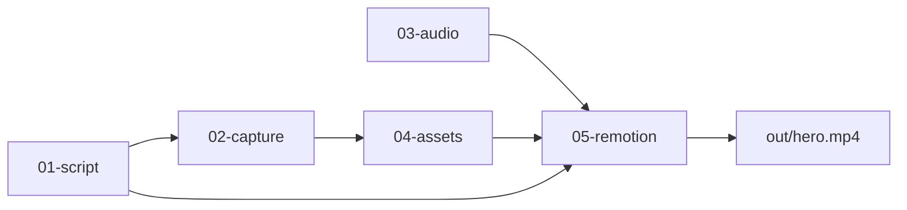

# UpSight Video Library

Every marketing video is a **self-contained project** under this folder.  
Folders are **numbered in production order** — work top to bottom.

## Folder order (read this first)

```text
40-gtm/assets/video/
├── README.md                    ← you are here
├── scripts/
│   └── new-video.sh             ← copy template → new project
├── _template-video/             ← duplicate this for each new video
│   ├── 01-script/               ← STEP 1: write copy + brief
│   ├── 02-capture/              ← STEP 2: raw screen recordings
│   ├── 03-audio/                ← STEP 3: voiceover + music
│   ├── 04-assets/               ← STEP 4: cleaned files for Remotion
│   └── 05-remotion/             ← STEP 5: build + render
│
├── outreach-asks/               ← VSL — The Thing You Already Know (3:14)
├── oside-app/                   ← MOVED → ~/code/oside-marketing
├── impossible-to-miss/          ← brand thesis film (Chiat Day–level)
├── account-signal/              ← consulting Account Signal opener (CS/churn)
├── survey-vsl/                  ← earlier CSAT survey cut (narrower framing)
├── never-start-at-zero/         ← VSL — compounding profiles (~0:51 mute cut)
├── upsight-homepage-hero/       ← live project
├── upsight-smart-surveys/       ← live project (short hero)
├── upsight-ssd-demo/            ← live project
├── remotionVideos-UpSight/      ← legacy ad factory (deprecated)
└── _shared/                     ← optional cross-video brand tokens
```

## The five folders — what goes where

| # | Folder | Put here | Do NOT put here |
|---|--------|----------|-----------------|
| **01** | `01-script/` | `hero.script.json` (on-screen copy), `hero.prompt.md` (creative brief), `notes.md` | PNGs, MP4s, audio |
| **02** | `02-capture/` | Raw ScreenStudio / OBS exports, unedited screen recordings | Final renders, logos |
| **03** | `03-audio/` | VO `.wav`, music beds, SFX | Screen recordings |
| **04** | `04-assets/` | Logos, UI screenshots, trimmed clips **ready for Remotion** | Raw captures (use 02) |
| **05** | `05-remotion/` | Remotion code, `npm install`, rendered `out/hero.mp4` | Strategy docs |

### `04-assets/` subfolders

```text
04-assets/
├── logos/          upsight-logo.png, partner logos
├── ui/             product screenshots, exported frames (PNG/WebP)
├── video/          trimmed screen clips for ScreenshotFrame (MP4)
└── icons/          one-off SVGs or small graphics
```

Remotion reads assets via `05-remotion/public` → symlinked to `../04-assets`.  
Reference in code as: `staticFile("logos/upsight-logo.png")` or `staticFile("ui/survey-home.png")`.

## Start a new video

```bash
cd /Users/rickmoy/code/upsight-marketing/40-gtm/assets/video
./scripts/new-video.sh upsight-sales-followup
```

Then:

1. Edit `upsight-sales-followup/01-script/hero.script.json` — change headlines, scenes, CTA
2. Edit `upsight-sales-followup/01-script/hero.prompt.md` — creative brief for you or the agent
3. Drop ScreenStudio exports into `02-capture/`
4. Drop VO into `03-audio/`
5. Export cleaned UI stills/clips into `04-assets/ui/` and `04-assets/video/`
6. Build scenes in `05-remotion/src/`
7. Preview and render:

```bash
cd upsight-sales-followup/05-remotion
npm install
npm run studio    # scrub timeline
npm run render    # → out/hero.mp4
```

## Edit copy without touching React

Open `01-script/hero.script.json`, change text or scene durations, then re-run `npm run render` in `05-remotion/`.

## Captions

Every `05-remotion/` (including the template) ships a caption pipeline —
transcribe a source video, correct known product-name mistranscriptions,
and render branded word-timed captions (`clean` / `emphasis` /
`productDemo`). See `05-remotion/src/captions/README.md` in any project
for setup and the `npm run caption-video` CLI.

## Active videos

| Slug | Purpose | Script | Output |
|------|---------|--------|--------|
| `outreach-asks` | VSL — The Thing You Already Know (3:14 + :30 + :15) | `01-script/hero.script.json` | `05-remotion/out/TheThingYouAlreadyKnow.mp4` |
| `impossible-to-miss` | Brand thesis film — already telling you → impossible to miss | `01-script/hero.script.json` | `05-remotion/out/ImpossibleToMiss.mp4` |
| `upsight-homepage-hero` | Leadership meeting prep homepage hero | `01-script/hero.script.json` | `05-remotion/out/hero.mp4` |
| `upsight-smart-surveys` | AI survey — voice, text, chat (short hero) | `01-script/hero.script.json` | `05-remotion/out/hero.mp4` |
| `upsight-survey-vsl` | Survey VSL — The Survey That Talks Back (~2:37) | `01-script/hero.script.json` | `05-remotion/out/SurveyVSL.mp4` |
| `never-start-at-zero` | VSL — compounding profiles, never start at zero (~0:51 mute cut) | `01-script/hero.script.json` | `05-remotion/out/NeverStartAtZero.mp4` |
| `upsight-ssd-demo` | SSD board/founder demo (2:30) | `01-script/hero.script.json` | `05-remotion/out/ssd-demo.mp4` |

## Production workflow (typical)



1. **Script** — lock message and scene timing in JSON
2. **Capture** — record product in ScreenStudio
3. **Assets** — trim/export the best frames and clips into `04-assets/`
4. **Audio** — optional VO; add to Remotion when ready
5. **Remotion** — animated mockups and/or `ScreenshotFrame` with real UI
6. **Render** — `out/hero.mp4` for homepage, ads, or sales

## Legacy locations (deprecated)

Older work may still exist at:

- `40-gtm/assets/video/remotionVideos-UpSight/` — original ad factory
- `~/code/upsight-ai-survey-hero/` — one-off before this structure

**Use `40-gtm/assets/video/<slug>/` going forward.**

## Tips

- **One video = one folder.** Never mix captures from two videos in the same `02-capture/`.
- **Raw vs ready:** `02-capture/` is messy; `04-assets/` is what Remotion uses.
- **Symlink:** `05-remotion/public` points at `04-assets` — add files to `04-assets/`, not `public/`.
- **Naming:** `ui/survey-voice-tab.png` beats `Screen Recording 2026-07-01.mov` in assets.
