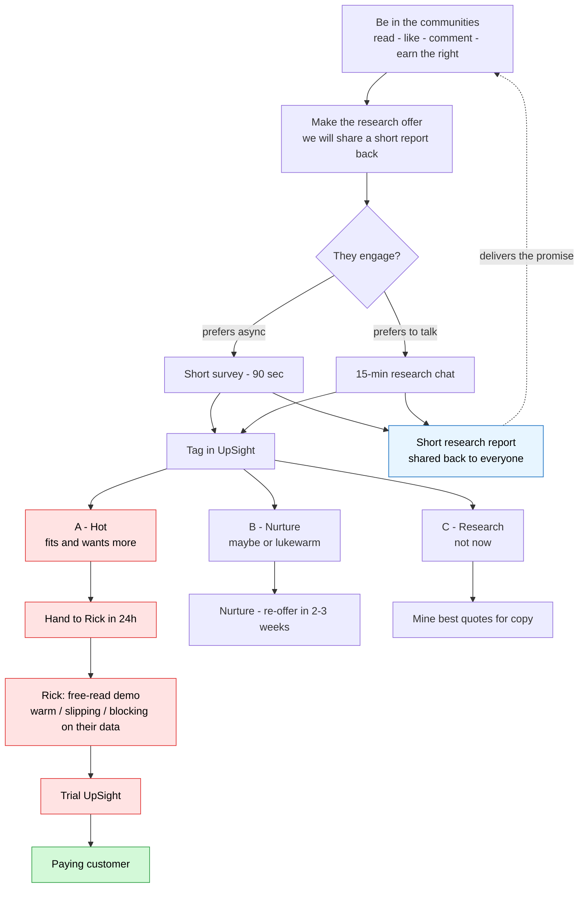
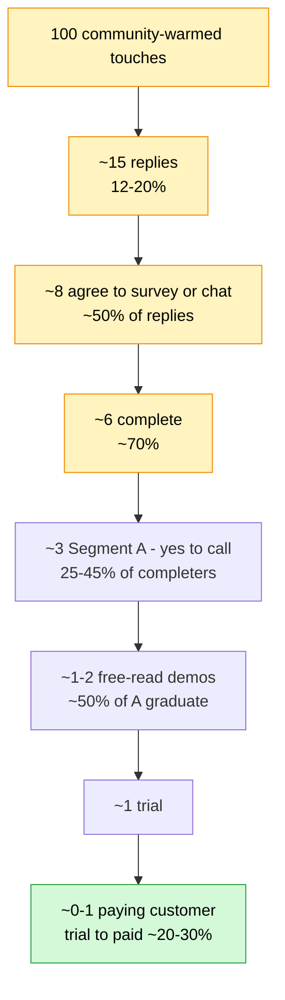

# Nessa Run Sheet — Start Here

> **Read this doc, not the whole vault.** The strategy folders (`30-strategy/…`) are background
> for Rick — you do **not** need them to do great work. Everything you need is below or linked here.
> When in doubt, do the next thing on today's checklist and ask Rick if blocked.

---

## Your mission (in two sentences)
You're running a **research-led outreach** program: become part of the communities where founders and
event organizers hang out, talk to people about how they work, capture what they say, and flag the warm ones.

**The honest thing you're offering — your North Star:** we're doing research on how people track and
follow up with customers (and how organizers handle attendee & sponsor feedback), so we can understand
them better — and we'll **write a short research report and share it back with the community.** That
shared report is the reason we're having these conversations, and it's the thing you can always offer
people: *"I'll send you the findings."* The research is genuinely useful; leads are the byproduct.
(Doc 5 shows exactly what that report looks like.)

---

## The funnel (the whole motion on one screen)

> Nessa owns the top (community → research → survey/chat → tag). Rick takes the hot ones from the
> handoff down: **free-read demo on their own data → trial → paying customer** (green). The report
> (blue) loops back and keeps you welcome in the community next time.

---

## Funnel #2 — the conversion math (the business view)

> Illustrative, primary-ICP, per **100 community-warmed touches.** Warm seeds convert higher; the
> event-organizer track runs a bit lower. **Nessa owns the top** (the wide stages — real conversations
> and quotes); the lower stages are Rick's to convert. Trial→paid is an industry estimate, not a promise.

> Takeaway: it takes a healthy **top** to make one customer — which is why showing up in the communities
> every day (the widest stage, yellow) is the whole game. Good conversations there feed everything below.

## This week's focus: **60% founders / 40% event organizers**
Two tracks. Spend more time on founders. Pick which track a given block is for and stick to it.

---

## The ONLY docs you need

| When | Doc | What it gives you |
|---|---|---|
| Daily | **This run sheet** | Your tasks + rhythm |
| Founders track | `research-led-leadgen-founder-spreadsheet-2026-06-09.md` → **Outreach copy** + **Short survey** sections only | What to send + the survey |
| Events track | `nessa-event-organizer-leadgen-2026-06-09.md` → **Outreach copy** + **Short survey** sections only | What to send + the survey |
| When someone's interested | `nessa-outreach-kit-2026-06-03.md` → **Talk track** + the **free-read offer** | How to run the chat + the next offer |
| When responses come in | `assets/collateral/research-benchmark-report-template.md` | The report you promised them |

> You can ignore everything else in the repo. If a doc isn't in this table, you don't need it this week.

---

## Daily rhythm (basically the same every day)

Work in this order, every session:

1. **Be in the communities — read, like, comment (do this first).** Before any names or messages,
   spend real time in the forums and groups (founders: StartupSD / r/SaaS / Lenny's; events:
   #eventprofs / event groups). Read posts, like, leave genuine comments, get a feel for how each
   community talks. You're becoming a familiar face and **earning the right** to ask. This comes
   before everything else — no links, no selling.
2. **Work the warm seeds.** Once Rick has added names to the **Seed research list** (in each track's
   doc), reach out to the top unworked person, or follow up on one you've already messaged.
3. **Make the research offer.** When you've earned it, share what we're doing — honestly:
   *"We're doing research on how people track and follow up with customers, to understand them better.
   We'll write up a short research report and share it back. Could I get your take?"* Use the
   **Outreach copy** for today's track; personalize the first line (prove you looked). Stop on reply.
4. **Run / book chats (rolling).** Anyone who says yes → book or run the 15-min chat. Use the **Talk track**
   doc. Always close by confirming you'll send them the findings. Tag them in UpSight after (see below).
5. **Log it.** Fill today's row in your log (template at the bottom). Drop questions for Rick in there.

**Daily goals:** keep growing your presence in the communities · work several warm seeds · make a
healthy batch of genuine, personalized asks · keep your chat calendar filling. Quality beats raw count —
a day with 2 great chats and a dozen real interactions beats 30 rushed messages.

---

## Weekly rhythm
You do basically the same thing every day — no day-specific to-do list. Just keep the rhythm going,
and we review at the end of the week.

- **Touch base with Rick: Monday, Wednesday, Friday.** Quick check-ins — what's working, what's stuck,
  any warm ones to hand off.
- **End of week:** a short recap → *people reached / chats done / best quotes you heard / what's stuck.*
  We'll look at it together and adjust for next week.

---

## After every chat — tag in UpSight
Put the person in UpSight and tag their segment:
- **A — hot:** fits the profile + said yes to more → tell Rick within 24h (he runs the next step).
- **B — nurture:** lukewarm / "maybe" → note it, follow up in 2–3 weeks.
- **C — research:** not interested in a call → still grab their best quote.

> You don't sell or demo. You research, flag the hot ones, and hand them to Rick. That's the job.

---

## When to ask Rick (don't stay stuck)
- Can't find people to message → ask Rick for warm intros / seed names.
- Someone replied with a hard question about the product → hand to Rick, don't improvise.
- A message keeps getting no replies → bring it Friday, we'll rewrite it together.
- **Rule: stuck more than ~30 min on the same thing → ping Rick.** Don't burn an afternoon stuck.

---

## Your daily log (copy this row each day)

| Date | Track (F/E) | Touches sent | Replies | Chats booked/done | Best quote you heard | Stuck on / Q for Rick |
|------|-------------|--------------|---------|-------------------|----------------------|-----------------------|
|  |  |  |  |  |  |  |

> Keep it here or wherever Rick wants. The "best quote" column matters — those quotes become our marketing.

---

## What good looks like

**Each week**
- **5–8 real research chats** done.
- Several people tagged **Segment A** and handed to Rick.
- **12+ real quotes** about how people actually work, captured in your log.

**By end of week 2**
- **15–20 conversations** across both tracks.
- A steady handful of Segment A leads in Rick's hands.
- You understand the customer better than when you started — that's the real deliverable.

It is **not** about volume of messages — it's about real conversations and real quotes.
